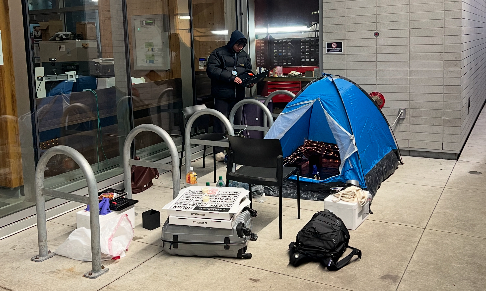

# JetBot
Click image for video of Robot demo (8 times speed**)  

Robot takes a picture of the dog when it spots it.

  
  
  

Our setup out in the cold Canadian winter night.  

## Inspiration
Inspired by the Palisades fires, where strong Pacific winds disrupted firefighting efforts and cause heavy smoke, we sought to create an autonomous system capable of locating people and animals trapped in smoke-filled environments during wildfires or earthquakes, using LLMs as navigation.

## What it does
An LLM-powered robot autonomously navigates smoke-filled environments, using multimodal input to analyze the live image feed from the robot and reason it's next movements based on what it sees and it's past actions.

## How we built it
We mounted an Nvidia Jetson Nano on a JetBot rover (essentially a donkey car) to collect image data and control it. We first used the OpenAI API as the "reasoning brains" of the robot, then later switched to a local server (with an RTX 3070) running Llama 3.2-vision (11B) using Ollama to keep things remote as service may be down in disaster sites.. Images are processed with prompting and previous moves are fed in with LangChain memory. The robot Jetson sends the data to a server and recieves move commands back.

## Challenges we ran into
Limited Jetson Nano disk space required shifting heavy processes to the server. Training the LLM to use conversation history and confidently navigate was another hurdle, requiring careful prompt engineering.

## Accomplishments that we're proud of
We successfully implemented LLM contextual reasoning using LangChain and prompt engineering techniques. It was an exciting challenge to fine-tune the process with more specific examples, ensuring greater precision and reliability. Additionally, we achieved seamless integration by linking everything with socket, creating a smooth and efficient system. Also, we're proud of camping outside all night for our dry ice smokey environment demo, enjoying multiple friendly visits from curious campus security.

## What we learned
We deepened our understanding of implementing chain-of-thought reasoning for LLMs and the importance of precision in prompt engineering to improve outcomes. The integration process also taught us valuable lessons about managing system architecture and achieving smooth communication between components. Beyond the technical insights, the demo preparation reinforced the significance of adaptability and creative problem-solving when working in dynamic environments.

## What's next for Controlling Robots with LLMs through Smoke
We aim to integrate Meta's DinoV2 model for depth estimation and 3D mapping, improving detection of people and animals in smoke. We also plan to use reinforcement learning to create a more robust and autonomous system for life-saving operations.